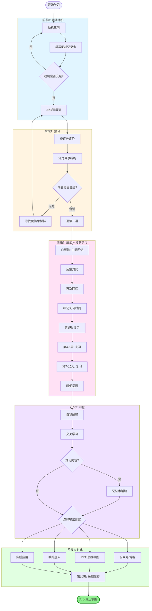

# 科学学习方法流程框架

> 基于脑科学和心理学研究的系统化学习流程

---

## 📋 流程总览



```
明确动机 → 预习 → 通读 → 内化 → 外化
   ↓        ↓      ↓      ↓      ↓
自我参照  快速了解  主动回忆  深度理解  知识输出
```

---

## 阶段0️⃣：明确动机（学习的根基）

**核心问题：为什么要学这个？**

### 动机三问
- [ ] **关联性**：这个内容与我的生活/工作/兴趣有什么关系？
- [ ] **价值性**：学会它能帮我解决什么实际问题？
- [ ] **目标性**：这是为了我自己的成长，还是仅为了外部奖励？

### 动机记录卡

| 学习内容 | 与我的关系 | 能解决的问题 | 内在目标 |
|---------|----------|------------|---------|
| 示例：Python | 工作需要数据分析 | 每周节省5小时手工处理时间 | 成为能独立解决问题的人 |
|  |  |  |  |

**✅ 内在目标**：自我提升、社会贡献、健康、人际关系  
**❌ 外在目标**：金钱、地位、声誉（动机不持久）

---

## 阶段1️⃣：预习（建立全局认知）

**目的：快速了解内容概况，判断价值和难度**

### 预习方法清单

**1. AI 快速概览**
- [ ] 使用 ChatGPT/Claude 询问："请用 500 字介绍《XXX》的核心内容和框架"
- [ ] 询问："这本书/课程的难度如何？适合什么基础的人？"
- [ ] 询问："学习这个内容的最佳路径是什么？"

**2. 查看评分和评价**
- [ ] 豆瓣读书：查看评分（>8.0 优先）和高赞书评
- [ ] 微信读书：查看想读人数、笔记划线数
- [ ] 知乎/小红书：搜索"XXX 值得学吗"、"XXX 学习心得"

**3. 浏览目录和结构**
- [ ] 快速翻阅目录，了解章节结构
- [ ] 看前言/序言，了解作者意图
- [ ] 翻看每章的小标题和总结

**4. 评估难度，选择入门材料**
- [ ] 如果内容过难，先找更简单的入门书/视频
- [ ] 原则：从易到难，先建立框架再深入细节

### 预习输出
- [ ] 用 1 句话总结：这个内容在讲什么
- [ ] 列出 3-5 个最想了解的问题
- [ ] 判断：我的基础是否足够？需要补充什么前置知识？

---

## 阶段2️⃣：通读（主动回忆 + 分散学习）

**目的：初步掌握内容，建立记忆基础**

### 通读的正确姿势

**✅ 正确做法**
- 通读一遍，理解整体框架
- 最小化标记（只标不懂的关键点）
- 在空白处写下疑问和思考

**❌ 避免错误**
- ❌ 反复通读同一内容
- ❌ 大段照抄笔记
- ❌ 只用荧光笔划线

### 核心方法：主动回忆循环

**每学完一个知识点/章节，立即执行：**

**步骤 1：主动回忆（白纸法）**
- [ ] 合上书/暂停视频
- [ ] 拿出白纸，像教别人一样，边说边写
- [ ] 写下所有记得的内容（概念、公式、例子、逻辑）
- [ ] 不要偷看！记不住是正常的（必要难度）

**步骤 2：反馈对比**
- [ ] 打开书本，用红笔标记：遗漏的、错误的、模糊的
- [ ] 重点阅读这些部分

**步骤 3：再次回忆**
- [ ] 换一张白纸，重复步骤 1
- [ ] 直到能完整、流畅地写出

**判断标准**
- ❌ "看着眼熟" = 熟练度错觉
- ✅ "能完整写出并解释" = 初步掌握

### 分散学习时间表

| 学习节点 | 时间 | 方法 |
|---------|------|------|
| 首次学习 | 第 1 天 | 通读 + 白纸法×3 |
| 第 1 次复习 | 第 2 天 | 白纸回忆 → 查漏补缺 |
| 第 2 次复习 | 第 4-5 天 | 白纸回忆 + 交叉学习 |
| 第 3 次复习 | 第 7-10 天 | 综合练习 + 教别人 |
| 长期保持 | 第 30 天+ | 实际应用 |

**分散学习的关键**
- 间隔时间越长，长期记忆效果越好
- 遗忘后再回忆，记忆更牢固
- 每次复习都要"先回忆，后查看"

---

## 阶段3️⃣：内化（深度理解与灵活运用）

**目的：建立知识体系，实现深度理解**

### 方法1：精细提问

**在学习过程中不断追问：**
- [ ] **为什么**：为什么会这样？为什么不是别的？
- [ ] **如何**：这是如何发生的？背后的机制是什么？
- [ ] **关联**：这与我已知的 XXX 有什么关系？
- [ ] **应用**：这能解释哪些现象？能解决什么问题？
- [ ] **反例**：有没有反例？什么情况下不成立？

**示例：学习"复利"**
```
- 为什么复利比单利厉害？→ 利息产生新利息
- 这能解释什么现象？→ 为什么要尽早投资
- 与我已知的什么相关？→ 类似知识的积累也有复利效应
- 反例是什么？→ 高通胀环境下复利效应减弱
```

### 方法2：自我解释（元认知）

**定期进行自我对话：**
- [ ] 用自己的话完整解释一遍
- [ ] 哪些部分我真正懂了？哪些还模糊？
- [ ] 我能举出 3 个例子吗？
- [ ] 如果要教给小白，我会怎么讲？

**掌握程度自评**
- √ = 完全掌握，能教别人
- △ = 基本理解，但不够熟练
- ○ = 还没搞懂，需要重点突破

### 方法3：交叉学习

**将相似但不同的知识混在一起学**

**❌ 分块学习（低效）**
```
第 1 天：只学第 1 章
第 2 天：只学第 2 章
第 3 天：只学第 3 章
```

**✅ 交叉学习（高效）**
```
第 1 天：第 1 章学一半 + 第 2 章学一半
第 2 天：复习第 1 章 + 学第 3 章 + 复习第 2 章
第 3 天：混合做三章的题目（打乱顺序）
```

**交叉学习的好处**
- 必须主动判断用哪个知识（增加必要难度）
- 更接近真实应用场景
- 培养灵活思维

### 方法4：记忆术（攻克难记内容）

**仅用于特别难记的内容：专业术语、外语单词、数字、人名**

**技巧选择：**
- **图像转换法**：将文字转为图像（谐音、联想）
- **故事法**：将多个图像串成荒诞有趣的故事
- **地点法**：将图像放在熟悉地点（记忆宫殿）

**示例：记单词 dearth（不足）**
```
→ 联想到 Darth Vader（达斯·维达）
→ 想象他"缺"少爱
→ 记住 dearth = 不足
```

---

## 阶段4️⃣：外化（知识输出与应用）

**目的：通过输出巩固理解，实现知识变现**

### 外化形式清单

**1. 写作输出**
- [ ] **公众号文章**：用自己的话讲给大众听
  - 标题：吸引人的角度
  - 结构：问题 → 原理 → 方法 → 案例
  - 语言：通俗易懂，多用比喻
- [ ] **个人笔记/博客**：系统梳理知识体系
- [ ] **知乎/小红书**：回答相关问题，输出观点

**2. PPT/可视化**
- [ ] 制作知识地图（思维导图）
- [ ] 做 PPT 总结核心要点（假装要做分享）
- [ ] 用图表呈现逻辑关系

**3. 口头输出**
- [ ] **教给别人**（学徒效应）：向朋友/同事讲解
- [ ] **费曼技巧**：用最简单的语言讲给外行听
- [ ] **录音/视频**：录下自己的讲解，发现卡壳的地方

**4. 实践应用**
- [ ] 在工作中使用学到的方法
- [ ] 做项目，解决实际问题
- [ ] 建立自己的案例库

### 外化质量标准

**✅ 优秀的外化**
- 能让完全不懂的人听懂
- 有清晰的逻辑结构
- 有具体的例子和应用
- 能回答别人的疑问

**❌ 低质量的外化**
- 只是复制粘贴原文
- 堆砌专业术语
- 缺乏个人理解和思考

---

## 💪 学习支撑系统

### 环境准备
- [ ] 手机放另一个房间
- [ ] 关闭所有通知
- [ ] 准备白纸和笔
- [ ] 选择合适的学习地点（定期更换）

### 身心管理
- [ ] **睡眠**：每天 7-9 小时，学习后尽快入睡
- [ ] **运动**：每周 150 分钟中等强度运动
- [ ] **焦虑**：写日记、分解目标、专注当下

### 进度追踪
| 日期 | 阶段 | 内容 | 方法 | 掌握度 | 下次复习 |
|------|------|------|------|--------|---------|
| 11/11 | 通读 | 第 1 章 | 白纸×3 | 70% | 11/12 |
| 11/12 | 复习 | 第 1 章 | 白纸回忆 | 85% | 11/15 |

---

## 🎯 核心原则

1. **动机第一**：没有动机，方法再好也无用
2. **输出>输入**：学习的本质是回忆与输出
3. **间隔>集中**：分散学习比集中学习效果好数倍
4. **理解>记忆**：深度理解才能长期保持
5. **应用>知道**：只有输出和应用才能真正掌握

---

## 📌 快速开始检查清单

**今天就开始：**
- [ ] 填写动机记录卡（为什么学？）
- [ ] AI 问询 + 查评分（值得学吗？）
- [ ] 通读第一部分
- [ ] 合上书，白纸回忆 3 次
- [ ] 标记下次复习时间（明天、3 天后、7 天后）
- [ ] 选择一个外化形式（写文章/教别人/做 PPT）

**记住：**
> "成功不是因为天赋，而是因为用对了方法。"

---

*基于脑科学和认知心理学研究整理*
