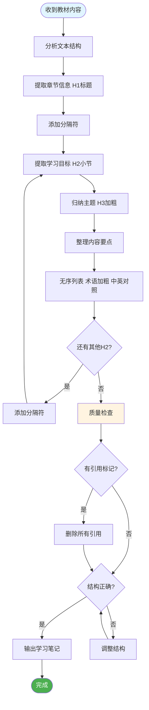

我正在学习一门课程，需要你帮助我根据提供的教材内容（通常是章节文本）来总结核心知识点。

你的任务是扮演一个专业的学术助手，将我给你的原始文本材料，严格按照以下规范和格式，整理成一份结构化、精炼、易于复习的学习笔记。

## 工作流程图

**输出格式规范：**

1. **章节标题 (H1):**
   * 使用 Markdown H1 (`#`)。
   * 格式：`# [章节号] [中文章节名] ([英文章节名])`
   * *示例:* `# 第1章 什么是组织行为学？ (What Is Organizational Behavior?)`
2. **分隔符:**
   * 在每个 H1 标题之后，以及每个 H2 小节标题之后（在下一个 H2 之前），必须使用一个 Markdown 水平分隔符 (`---`)。
3. **小节标题 (H2):**
   * 使用 Markdown H2 (`##`)。
   * 格式：`## [章节内编号] 📖 [中文小节标题/学习目标] ([英文小节标题/学习目标])`
   * *注意:* 必须包含 `📖` 这个 emoji。
   * *示例:* `## 1-1 📖 定义组织行为学 (Define organizational behavior (OB))`
4. **主题标题 (H3):**
   * 在每个 H2 小节内部，使用 H3 (`###`) 来归纳一组相关的知识点。
   * 格式：`### **[加粗的主题词或短语]**`
   * *示例:* `### **管理与组织行为学**`
5. **内容要点 (列表):**
   * 在 H3 标题下，使用无序列表 (`-`) 来阐述具体的知识点。
   * **关键术语加粗:** 列表项中的核心概念或引导词必须加粗，并以冒号结尾。格式：`**[关键术语]**：`。
   * **中英对照:** 对于首次出现的专业术语，必须在中文后用括号注明其英文原文。如果术语有常用缩写，也应一并注明。*示例:* `(Evidence-Based Management, EBM)`。
   * **嵌套层级:** 如果知识点包含子分类或多层逻辑，请使用嵌套的无序列表（缩进）来清晰展示其结构。
   * **内容要求:** 内容必须是高度概括和总结性的，准确传达原文的核心定义、分类、步骤、原因或影响。避免逐字复制原文。
6. **表格 (Table):**
   * **适用场景:** 当内容涉及以下情况时，**优先使用表格**而非列表：
     - **多维度对比**：比较多个概念/分类的不同属性（如：定义、特点、示例）
     - **分类汇总**：将多个类别按统一维度进行整理（如：角色-职责、层次-内容）
     - **并列概念**：多个并列项各自有固定属性需要展示
   * **表格格式要求:**
     - 表头使用加粗：`| **列名1** | **列名2** |`
     - 表格内关键术语同样需要加粗并标注英文
     - 每行内容简洁，避免单元格过长
   * **何时不用表格:** 当内容是线性论述、因果关系说明、或深层嵌套逻辑时，仍使用列表

**关键指令：**

* **绝对禁止引用:** 生成的总结内容中，**绝对不能**包含任何形式的引用标记（例如 `[1]`、`[23]`、`[cite]` 等）。
* **遵循结构:** 必须严格遵循上述 H1 -> H2 -> H3 -> 列表/表格 的结构层次。
* **参考标准:** 你生成的格式应严格对标我之前提供给你的 `example`（即《第1章 什么是组织行为学？》的那个例子）。

---

`<example>`

# 第1章 什么是组织行为学？ (What Is Organizational Behavior?)

------

## 1-1 📖 定义组织行为学 (Define organizational behavior (OB))

### **管理与组织行为学**

- **组织行为学的重要性**：过去商学院更注重如经济、会计等技术性强的"硬"技能。但现在，人际交往能力在决定管理者效率方面的关键作用已得到广泛认可。例如，领英（LinkedIn）的执行主席认为，沟通能力是美国各大城市中最稀缺的技能。
- **学习 OB 的价值**：学习组织行为学有助于提升批判性思维、决策能力、沟通协作效率以及职场社会责任感。重视这些"就业技能"的公司往往财务表现更佳，也更能吸引和留住优秀人才。
- **改善工作环境**：良好的同事关系与员工的工作满意度、压力大小和离职倾向直接相关。积极的工作社交关系能促进员工个人发展，提高生活满意度。

### **工作中的角色定义**

| **角色** | **定义** |
|:--|:--|
| **工作者 (Worker)** | 在组织内完成任务、为实现目标做出贡献的个体 |
| **管理者 (Manager)** | 通过协调他人来达成目标的人，主要职责包括决策、资源分配和指导活动 |
| **组织 (Organization)** | 由两人或以上组成的、有意识协调运作的社会单位，旨在持续地实现一个或多个共同目标 |

### **管理活动与角色**

管理者主要进行四种核心活动：

| **活动** | **核心内容** |
|:--|:--|
| **计划 (Planning)** | 确立目标、制定战略和协调各项活动 |
| **组织 (Organizing)** | 设计工作结构，明确任务分工、分组方式和汇报层级 |
| **领导 (Leading)** | 激励员工、指导其活动、选择有效的沟通方式以及解决冲突 |
| **控制 (Controlling)** | 监督组织绩效，将其与预设目标对比，并纠正显著偏差 |

根据学者亨利·明茨伯格的理论，管理者扮演十种相互关联的角色，可归为三大类：

| **角色类别** | **具体角色** |
|:--|:--|
| **人际关系角色 (Interpersonal)** | 挂名首脑、领导者、联络人 |
| **信息角色 (Informational)** | 监督者、传播者、对外发言人 |
| **决策角色 (Decisional)** | 企业家、问题处理者、资源分配者、谈判者 |

### **所需管理技能**

管理者需要掌握三种基本技能：

| **技能类型** | **定义** |
|:--|:--|
| **技术技能 (Technical Skills)** | 运用专业领域知识或专长的能力 |
| **人际技能 (People Skills)** | 理解他人、与之沟通、激励并支持他人的能力 |
| **概念技能 (Conceptual Skills)** | 分析和诊断复杂情况的思维能力 |

### **成功的管理者 vs. 有效的管理者**

| **类型** | **特点** | **时间投入重点** |
|:--|:--|:--|
| **成功的管理者** | 晋升速度快 | 建立社交网络 (Networking) |
| **有效的管理者** | 工作绩效最优 | 沟通 (Communication) |

> **启示**：在组织中，晋升不仅取决于工作绩效，社交和政治技巧也至关重要。

### **组织行为学 (OB) 的定义**

- **定义**：组织行为学是一门研究个体、群体和组织结构对组织内部行为产生何种影响的学科，其目的是运用这些知识来提高组织的整体效能。
- **核心内容**：它研究人们在组织中的所作所为及其对组织绩效的影响。核心主题涵盖绩效、工作态度、多样性、激励、领导力、冲突、组织结构和文化等方面。

------

## 1-2 📖 展示系统性研究的价值 (Show the value of systematic study to OB)

### **系统研究与证据管理**

| **概念** | **定义** | **核心要点** |
|:--|:--|:--|
| **系统研究 (Systematic Study)** | 通过观察关系、探寻因果，并基于科学证据得出结论 | 数据在受控条件下收集，进行严谨的测量和解读 |
| **循证管理 (Evidence-Based Management, EBM)** | 主张管理决策应基于现有最佳的科学证据 | 在专业经验、商业实践和科学证据之间取得平衡 |

- **超越直觉**：我们在生活中一直在"解读"他人，但这往往是随意的，可能导致错误的预测。组织行为学认为行为并非随机，而是有其内在规律，因此可以通过系统化的方法进行更准确的预测。
- **平衡直觉与证据**：完全依赖直觉或"胆量"做决策，如同只掌握一半信息就进行投资。管理者常因认知偏见而高估自己的知识，或固守与经验证据相悖的"常识"。

### **大数据与人工智能 (AI)**

- **大数据的发展**：大数据分析最初应用于在线零售，通过追踪客户的浏览、购买行为和偏好，来制定精准的营销策略并预测消费趋势。
- **大数据的当前应用**：现在，大数据被广泛用于预测事件、评估风险和预防灾难。例如，科技公司用它来预测用户行为，保险公司用它来评估风险以设定保费。
- **人工智能与机器学习**：随着数据量的激增，AI 和机器学习（AI 的一个子集，软件能从数据中"学习"和"改进"）成为处理和分析信息的关键。例如，亚马逊超过三分之一的交易来自 AI 驱动的商品推荐。
- **研究的新方法**：大数据和 AI 为组织行为学研究带来了新方法，包括机器人技术、严肃游戏、可穿戴生物传感器、社交媒体分析和文本情绪分析等。

### **局限与挑战**

| **挑战** | **说明** |
|:--|:--|
| **隐私问题** | 大规模数据收集（尤其是通过监控设备）引发了严重的隐私担忧 |
| **社会因素的复杂性** | 霍桑实验证明，员工的生产力不仅受监控影响，更取决于他们是否感到被关心以及团队内的社会动态 |
| **AI 的局限** | 机器可能无法理解整体"大局"，其算法可能产生无理论依据的预测，需要人工监督以避免不合逻辑的决策 |

> **总结**：我们不应完全抛弃直觉，但更明智的做法是尽可能地利用证据来辅助决策，并通过严谨的系统研究来检验直觉。这正是组织行为学所倡导的核心价值。

------

## 1-3 🧬 识别对OB有贡献的主要行为科学学科 (Identify the major behavioral science disciplines that contribute to OB)

组织行为学（OB）是一门应用行为科学，它建立在多个行为学科的贡献之上。这些学科的关注点各有不同：

| **学科** | **分析层面** | **核心关注** | **主要贡献领域** |
|:--|:--|:--|:--|
| **心理学 (Psychology)** | 个体/微观层面 | 衡量、解释、改变人类行为 | 学习、感知、个性、情绪、动机、领导效能、工作满意度、决策、绩效评估、工作压力 |
| **社会心理学 (Social Psychology)** | 个体与群体之间 | 人与人之间的相互影响 | 变革管理、态度测量与改变、沟通模式、信任建立、群体行为、权力与冲突 |
| **社会学 (Sociology)** | 群体/组织层面（宏观） | 人与社会环境/文化的关系 | 组织文化、正式组织理论与结构、组织技术、沟通、权力与冲突 |
| **人类学 (Anthropology)** | 社会/文化系统 | 通过研究不同社会了解人类 | 组织文化、组织氛围、跨国文化差异、价值观与行为差异 |

> **特别说明**：心理学对情绪和心境的研究引发了"情感革命"，深刻影响了组织行为学的各个领域。

------

## 1-4 ⚖️ 阐明为何鲜有绝对真理适用于OB (Demonstrate why few absolutes apply to OB)

与物理、化学等自然科学中存在普适定律不同，组织行为学（OB）中几乎没有简单且绝对的原则。其主要原因在于：

| **原因** | **说明** |
|:--|:--|
| **人的复杂性** | 人类是非常复杂的个体，人与人之间存在显著差异，很难做出能够适用于所有人的简单、准确的概括 |
| **情境依赖性** | 同一个人的行为在不同情境下会发生改变，而不同的人在相同情境下的反应也常常大相径庭 |
| **权变变量的重要性** | 组织行为学的结论必须考虑"权变条件"或"情境因素"，即一个结论（X 导致 Y）通常只在特定条件下（Z）才成立 |

- **权变变量 (Contingency Variables)**：调节一般规律的情境因素。例如，"人人都喜欢有挑战性的工作"是错误的绝对化陈述，因为工作的吸引力取决于个人偏好。

> **总结**：我们不能像套用物理公式那样来预测人类行为。要准确地解释和预测组织中的行为，就必须认识到一般规律和调节这些规律的情境因素同等重要。

------

## 1-5 🌍 识别管理者在应用OB概念中的挑战与机遇 (Identify managers' challenges and opportunities in applying OB concepts)

在当今快速变化的组织环境中，理解并应用组织行为学（OB）的理念对管理者而言，既是挑战也是机遇：

| **领域** | **挑战** | **机遇** |
|:--|:--|:--|
| **劳动力多样性与包容性 (Workforce Diversity and Inclusion)** | 管理在性别、年龄、种族、性取向等方面日益多元化的团队 | 创造包容的工作环境，让每位员工充分发挥潜力 |
| **持续的全球化 (Continuing Globalization)** | 跨国工作或与不同文化背景的同事合作 | 发展跨文化敏感性，适应不同文化背景下的员工需求 |
| **技术与社交媒体 (Technology and Social Media)** | 应对"永不下线"文化带来的工作与生活界限模糊 | 利用社交媒体进行招聘和营销 |
| **（非）道德行为 ((Un)ethical Behavior)** | 在竞争和业绩压力下员工面临道德困境 | 创造强有力的道德文化和氛围 |
| **企业社会责任 (CSR)** | 实施真诚有意义的 CSR 项目 | 提升员工认同感和使命感，增强组织声誉 |
| **积极的工作环境 (Positive Work Environments)** | 超越纠正问题，关注组织优点和长处 | 通过发掘员工优势、韧性和活力创造积极环境 |
| **零工经济 (The Gig Economy)** | 管理非传统雇佣关系的"零工"形式工作者 | 更灵活的人才利用方式 |
| **危机时期的 OB (OB During Crises)** | 处理员工压力、做出艰难决策 | 运用 OB 理论在危机中做出更明智的决策 |

------

## 1-6 📈 比较OB模型中的三个分析层次 (Compare the three levels of analysis in this text's OB model)

组织行为学（OB）通过一个系统模型来分析和理解组织内的行为。这个模型包含**三个分析层次**和**三类变量**。

### **三个分析层次**

1. **个体层面 (Individual Level)**
2. **群体层面 (Group Level)**
3. **组织层面 (Organizational Level)**

这三个层次逐级递进，构成了对组织行为的完整分析框架。

### **三类变量概览**

| **变量类型** | **比喻** | **定义** |
|:--|:--|:--|
| **输入 (Inputs)** | 模型中的"名词" | 决定后续事件的变量，为过程设定了舞台 |
| **过程 (Processes)** | 模型中的"动词" | 个体、群体和组织因输入而采取的、并最终导致结果的行动 |
| **结果 (Outcomes)** | 模型中的"目标" | 我们希望解释或预测的关键变量，受到输入和过程的影响 |

### **各层次的输入与过程**

| **层次** | **输入 (Inputs)** | **过程 (Processes)** |
|:--|:--|:--|
| **个体层面** | 多样性、个性、价值观 | 情绪与心境、动机、知觉、决策 |
| **群体层面** | 群体结构、角色、团队职责 | 沟通、领导力、权力与政治、冲突与谈判 |
| **组织层面** | 组织结构、文化 | 人力资源管理、变革实践 |

### **各层次的结果**

| **层次** | **结果类型** | **说明** |
|:--|:--|:--|
| **个体层面** | 态度与压力 | 员工对工作、人或事件的评价及其心理反应 |
| | 工作绩效 | 员工通过自身行为为组织贡献的总价值（核心结果） |
| | 组织公民行为 (OCB) | 超越正式工作要求的、有助于工作环境的自愿行为 |
| | 退缩行为 | 员工脱离组织的行为，如迟到、缺勤、离职 |
| **群体层面** | 团队绩效 | 团队工作的数量和质量产出，不仅仅是个人绩效的简单相加 |
| **组织层面** | 生产力 | 组织以最低成本将投入转化为产出以实现其目标，包含效能和效率 |
| | 生存 | 组织能够长期存在和发展的能力，取决于生产力和适应环境的能力 |

> **模型的动态性**：**输入**引发**过程**，**过程**导致**结果**。同时，结果也会反过来影响未来的输入，形成一个动态循环。

------

## 1-7 ✍️ 描述通过学习OB获得的关键就业技能 (Describe the key employability skills gained from studying OB)

学习组织行为学（OB）不仅仅对商科专业的学生有益，它能培养一套关键的"就业技能"，这些技能对任何专业背景的学生在未来的职业生涯中都至关重要。

| **技能** | **定义** |
|:--|:--|
| **批判性思维与创造力 (Critical Thinking & Creativity)** | 有目的、有导向的思考方式，用于定义和解决问题、做出决策或形成判断，最终目标是产生新颖且有用的想法 |
| **沟通 (Communication)** | 为了多种目的（告知、指导、激励、说服）而有效运用口头、书面和非语言沟通技巧的能力，包括有效倾听以及评估沟通效果 |
| **协作 (Collaboration)** | 个体在团队中积极地共同完成任务的能力，通过对话和协商共同构建意义和知识 |
| **自我管理 (Self-Management)** | 为追求目标，有意识、有策略地管理个人行为、努力和情绪的能力，涉及自我控制、自我监控和自我调节 |
| **社会责任 (Social Responsibility)** | 涉及商业道德（指导个人和组织行为的原则）和企业社会责任（组织为社会和环境谋福利的道德行为） |
| **领导力 (Leadership)** | 影响一个群体以实现共同愿景或目标的能力，包括确立愿景、调整领导风格、建立关系和运用影响力 |
| **职业管理 (Career Management)** | 发展对现实世界就业环境的理解，具备在不同工作和职业间成功转换所需的专业敏锐度 |

`</example>`
