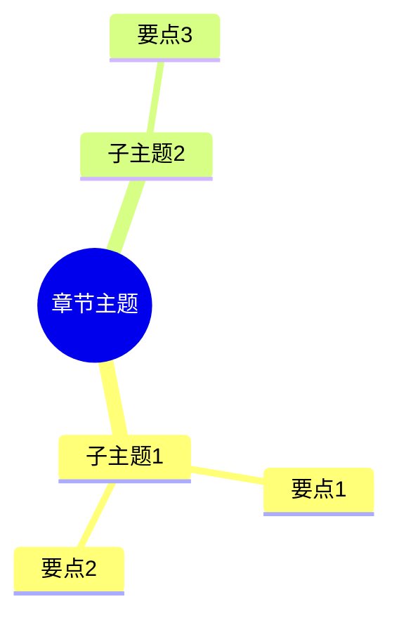

# 👀 预习笔记 Prompt

快速建立整体框架，形成"地图"，为通读做准备。

---

## 核心原则

> **预习的目的是建立框架，快速浏览、不求甚解，带着问题进入通读。**

预习阶段**可以**看结构化内容，这与内化阶段不同。

---

## 触发场景

- 开始阅读一本新书
- 开始一门新课程
- 上线下课程前
- 快速了解一个新主题

---

## 📚 书籍预习

请帮我对 **[书名]** 生成预习笔记：

### 1. 作者背景

- **作者**：
- **背景/立场**：（学术派/实践派/记者等）
- **其他知名作品**：

### 2. 结构大纲

从目录提取书籍结构，视为"导游图"：

```
第一部分：[主题]
  - 第1章：[章节名] - 关键词
  - 第2章：[章节名] - 关键词
第二部分：[主题]
  - 第3章：...
...
```

### 3. 前言/序言要点

- **写作动机**：作者为什么写这本书？
- **内容概述**：这本书讲什么？
- **核心观点**：作者的主要论点是什么？

### 4. 关键概念速览

快速翻阅后捕捉到的关键词（5-10个）：

| 概念 | 一句话解释 | 出现章节 |
|------|-----------|---------|
| **概念1** | ... | 第X章 |
| **概念2** | ... | 第X章 |

### 5. 待解答问题

预习后产生的疑问，带入通读阶段：

1. 为什么...?
2. 如何...?
3. ...与...有什么关系?

### 6. 阅读规划

- **全书预计阅读时间**：X 小时
- **重点章节**：第X、X章（建议精读）
- **可略读章节**：第X章（与我当前目标关联较弱）

---

## 🏫 线下课程预习

请帮我对 **[课程名/教材]** 生成预习笔记：

### 1. 讲师信息

- **讲师**：
- **研究方向**：
- **授课风格**：（案例导向/理论导向/互动式等）

### 2. 章节结构

```
本次课主题：...
├── 核心概念：
│   - 概念A
│   - 概念B
├── 知识点分布：
│   - 重点：...
│   - 难点：...
└── 与前后章节的关系：...
```

### 3. 思维导图

（可让 NotebookLM 生成或请 AI 用 Mermaid 绘制）



### 4. 课前问题清单

带着这些问题进入课堂：

1. ...
2. ...
3. ...

### 5. 预习检查清单

- [ ] 已了解讲师背景
- [ ] 已浏览教材/PPT
- [ ] 已听 NotebookLM 播客（如有）
- [ ] 已准备问题清单

---

## 🎓 系统课程预习

请帮我对 **[课程名]** 生成预习笔记：

### 1. 课程概览

- **讲师背景**：
- **课程时长**：X 小时
- **评分/评价**：
- **适合人群**：

### 2. 课程大纲

```
模块1：[名称]（X小时）
  - Lesson 1: ...
  - Lesson 2: ...
模块2：[名称]（X小时）
  ...
```

### 3. 学习计划

| 周次 | 模块 | 预计时间 | 产出 |
|------|------|---------|------|
| 第1周 | 模块1 | X小时 | 完成练习 |
| 第2周 | ... | ... | ... |

### 4. 关键技能点

本课程将学到的核心技能：

1. ...
2. ...

---

## 注意事项

- 预习不需要理解所有内容，建立框架即可
- 问题清单很重要，带着问题学习效率更高
- 预习时间不宜过长，约占整体学习时间的 10%
