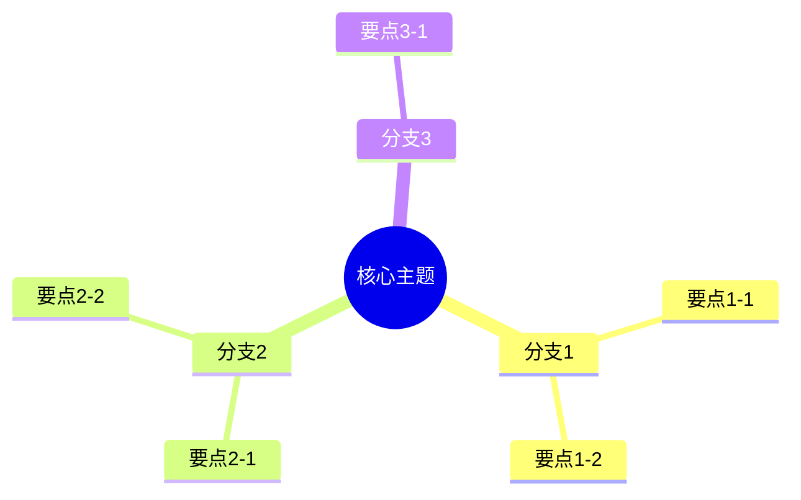

# 💬 外化成果 Prompt

将知识输出为可分享的形式，检验是否真正掌握。

---

## 核心理念

> **学习必须有输出，否则只是"感觉学了"。**

能输出 = 真正掌握

---

## 外化形式选择

| 形式 | 适用场景 | 工具 |
|------|---------|------|
| **写文章** | 概念理解、知识沉淀 | Notion / VitePress |
| **做PPT** | 演示汇报、教学分享 | PPT Master / Canva |
| **讲解稿** | 教别人、录视频 | 录音/录视频 |
| **做题** | 考试备考 | NotebookLM 生成题库 |
| **画图** | 流程/架构可视化 | Draw.io Master |
| **做项目** | 技能学习 | Cursor / VS Code |

---

## 选择外化形式后，请指定：

```text
请帮我基于 [材料] 生成【外化-讲解稿】
```

```text
请帮我基于 [材料] 生成【外化-自测题库】
```

---

## 📝 选项A：文章大纲

请帮我基于 **[材料]** 生成文章大纲：

### 1. 标题设计

- **主标题**：[吸引人的标题]
- **副标题**：[补充说明]

### 2. 开头

- **Hook**：吸引读者的开场
- **背景/问题**：为什么这个话题重要
- **文章价值**：读完能获得什么

### 3. 正文结构

#### 第一部分：[小标题]
- 核心观点
- 论据/案例
- 小结

#### 第二部分：[小标题]
- 核心观点
- 论据/案例
- 小结

#### 第三部分：[小标题]
- ...

### 4. 结尾

- 总结要点（3个关键点）
- 行动建议/呼吁

### 5. 素材清单

- [ ] 配图：...
- [ ] 数据：...
- [ ] 引用：...

---

## 🎤 选项B：讲解稿

请帮我基于 **[材料]** 生成讲解稿（约X分钟）：

### 1. 开场（1分钟）

**吸引注意力**：
> [开场白：故事/问题/惊人事实]

**主题引入**：
> 今天我们要聊的是...

**为什么重要**：
> 这个话题对你的意义是...

---

### 2. 主体

#### 第一部分：[标题]（X分钟）

**核心观点**：
> ...

**案例/故事**：
> ...

**过渡语**：
> 说完了...，我们来看...

---

#### 第二部分：[标题]（X分钟）

**核心观点**：
> ...

**案例/故事**：
> ...

---

### 3. 总结（1分钟）

**三个关键要点**：
1. ...
2. ...
3. ...

**行动建议**：
> 听完之后，你可以...

**结束语**：
> ...

---

### 4. Q&A 预判

| 可能的问题 | 我的回答 |
|-----------|---------|
| Q1: ...? | A1: ... |
| Q2: ...? | A2: ... |
| Q3: ...? | A3: ... |

---

## 📋 选项C：知识卡片

请帮我基于 **[概念名]** 生成知识卡片：

```markdown
# [概念名]

**一句话定义**：
> ...

**为什么重要**：
> ...

**核心要点**：
1. ...
2. ...
3. ...

**常见误区**：
> ❌ 错误理解：...
> ✅ 正确理解：...

**实际应用**：
> 场景：...
> 做法：...

**相关概念**：
- [概念A]
- [概念B]

**记忆口诀**：
> ...
```

---

## 🗺️ 选项D：思维导图

请帮我基于 **[材料]** 生成思维导图（Mermaid格式）：



---

## ✅ 选项E：自测题库

请帮我基于 **[材料]** 生成自测题库：

### 选择题

**Q1: ...**

- A. ...
- B. ...
- C. ...
- D. ...

<details>
<summary>查看答案</summary>

**答案：B**

**解析**：...

</details>

---

**Q2: ...**

...

---

### 简答题

**Q3: ...**

<details>
<summary>查看参考答案</summary>

...

</details>

---

### 论述题

**Q4: ...**

<details>
<summary>查看答案要点</summary>

1. ...
2. ...
3. ...

</details>

---

### 案例分析题

**Q5: [案例描述]**

问题：...

<details>
<summary>查看分析思路</summary>

1. 首先分析...
2. 然后考虑...
3. 最后...

</details>

---

## 📊 选项F：PPT大纲

请帮我基于 **[材料]** 生成PPT大纲：

### 幻灯片结构

| 页码 | 标题 | 内容要点 | 视觉建议 |
|------|------|---------|---------|
| P1 | 封面 | 标题、副标题、日期 | 全屏背景图 |
| P2 | 目录 | 三个主要部分 | 简洁列表 |
| P3 | 背景介绍 | 问题背景、重要性 | 数据图表 |
| P4 | 核心概念 | 定义、解释 | 图示化 |
| P5 | ... | ... | ... |
| Pn | 总结 | 关键要点回顾 | 三点总结 |
| Pn+1 | Q&A | 问题与讨论 | 简洁 |

---

## 注意事项

- 外化是检验学习的最终标准
- 选择适合目标受众的形式
- 不要只在脑子里想，要写出来/说出来
- 输出后可以再次内化不熟悉的部分
